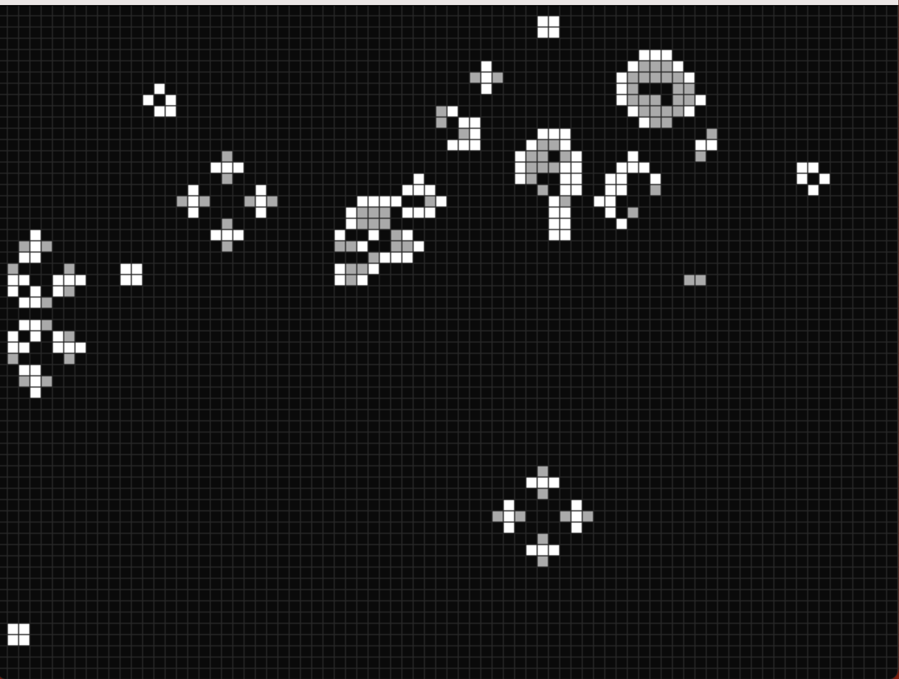

<!-- Improved compatibility of back to top link: See: https://github.com/othneildrew/Best-README-Template/pull/73 -->
<a id="readme-top"></a>
<!--

<!-- PROJECT LOGO -->
<br />
<div align="center">
  <a href="https://github.com/mutendisambaza/Game-of-Life">
    
  </a>

<h3 align="center">THE GAME OF LIFE</h3>

  <p align="center">
    ...where simplicity makes complexity possible.
    <br />
    <a href="https://github.com/github_username/repo_name"><strong>Explore the docs »</strong></a>
    <br />
    <br />
  </p>
</div>


<!-- TABLE OF CONTENTS -->
<details>
  <summary>Table of Contents</summary>
  <ol>
    <li>
      <a href="#about-the-project">About The Project</a>
      <ul>
        <li><a href="#built-with">Built With</a></li>
      </ul>
    </li>
    <li>
      <a href="#getting-started">Getting Started</a>
      <ul>
        <li><a href="#prerequisites">Prerequisites</a></li>
        <li><a href="#installation">Installation</a></li>
      </ul>
    </li>
    <li><a href="#usage">Usage</a></li>
    <li><a href="#acknowledgments">Acknowledgments</a></li>
  </ol>
</details>


<!-- ABOUT THE PROJECT -->
## About The Project

Tendi's Game of Life is a digital implementation of John Conway's "Game of Life," a cellular automaton devised in 1970. Though called a "game," it's more accurately described as a zero-player simulation that evolves over time based on its initial state and a set of simple rules. Despite its simplicity, the Game of Life is a powerful metaphor for the emergence of complex behavior from simple rules, making it a staple in computational theory, mathematics, and philosophy.

<br>
<h3>What Is the Game of Life?</h3>

The Game of Life consists of a grid of cells, each of which can be in one of two states: alive or dead. The simulation progresses in discrete time steps, and the state of each cell in the next generation depends on its current state and the states of its eight neighbors.
<br>
<div align="center">
  
</div>

<h3>Rules of the Game</h3> 

* Underpopulation: A living cell with fewer than two living neighbors dies (as if by underpopulation). <br>
- Survival: A living cell with two or three living neighbors lives on to the next generation.<br>
- Overpopulation: A living cell with more than three living neighbors dies (as if by overpopulation).<br>
- Reproduction: A dead cell with exactly three living neighbors becomes a live cell (as if by reproduction).<br>
These simple rules give rise to surprisingly complex patterns over time, which can simulate processes such as birth, death, and survival.
<div align="center">
  
</div>


<h3>Parameters</h3>
<strong>Grid Size:</strong> The grid can vary in size, with each cell representing a discrete unit of space. <br>
<strong>Initial State:</strong> The initial configuration of living and dead cells determines the system's evolution. This state can be randomized or manually set by the user.<br>
<strong>Simulation Speed:</strong> The rate at which the simulation progresses can be adjusted, controlling how quickly the grid evolves.
<br>

<h3>Famous Configurations</h3>
<div align="center">
  
</div>
Some initial configurations in the Game of Life have become famous for their interesting behaviors:

* <strong>Still Lifes:</strong> These patterns do not change from one generation to the next. Examples include the Block, Beehive, and Loaf.
* <strong>Oscillators:</strong> These configurations return to their initial state after a fixed number of generations. Common examples are the Blinker, Toad, and Beacon.
* <strong>Spaceships:</strong> These are patterns that move across the grid over time. The most well-known spaceship is the Glider, which moves diagonally.
* <strong>Guns and Puffer Trains:</strong> These configurations produce other objects, such as gliders, indefinitely. The most famous of these is the Gosper Glider Gun, which continually creates gliders.
<br>
<h3>Modern Applications</h3>

While the Game of Life is a simple model, it has profound implications and uses in various fields:

Computer Science: The Game of Life demonstrates the power of cellular automata and is often used as an introductory example in classes on algorithms and computational theory.<br>
Complex Systems: Researchers use the Game of Life to explore how complex behaviors emerge from simple rules, drawing parallels to real-world phenomena in biology, ecology, and social sciences. <br>
Philosophy: The game is sometimes used as a metaphor for life, evolution, and artificial life, illustrating how life-like behavior can emerge from inanimate matter.

<p align="right">(<a href="#readme-top">back to top</a>)</p>


### Built With

* [![Python][Python.js]][Python-url]
<p align="right">(<a href="#readme-top">back to top</a>)</p>


<!-- GETTING STARTED -->
## Getting Started

Follow these steps to set up Tendi's Game of Life on your local machine.

### Prerequisites

You’ll need to have Python, Pygame and numpy installed. [use pip3 on mac]
* Run the following command to install Pygame:
  ```sh
  pip install pygame
  ```
* Run the following command to install numpy:
  ```sh
  pip install numpy
  ```
### Installation

1. Clone the repo
   ```sh
   git clone https://github.com/mutendisambaza/Game-of-Life
   ```
3. Run the main file from your terminal in the file's directory. [use python3 on mac]
   ```sh
    python main.py
   ```

<p align="right">(<a href="#readme-top">back to top</a>)</p>


<!-- USAGE EXAMPLES -->
## Usage

Controls:

* Press <strong>Space</strong> to start/pause the simulation. <br>
* Press <strong>Enter</strong> to randomly generate a grid.<br>
* Press <strong>Backspace</strong> to clear the grid.<br>
* <strong>Left-click</strong> to activate cells manually.
<br><br>
Feel free to experiment with different starting configurations or let the simulation run for interesting patterns!
<p align="right">(<a href="#readme-top">back to top</a>)</p>

<!-- ACKNOWLEDGMENTS -->
## Acknowledgments

* John Conway, for his original work on cellular automata.
* Pygame Community, for maintaining the awesome library.
* Open Source Contributors, for making tools like this possible.

<p align="right">(<a href="#readme-top">back to top</a>)</p>

<!-- MARKDOWN LINKS & IMAGES -->
<!-- https://www.markdownguide.org/basic-syntax/#reference-style-links -->

[Python.js]: https://img.shields.io/badge/Python-14354C?style=for-the-badge&logo=python&logoColor=white
[Python-url]:https://www.python.org
